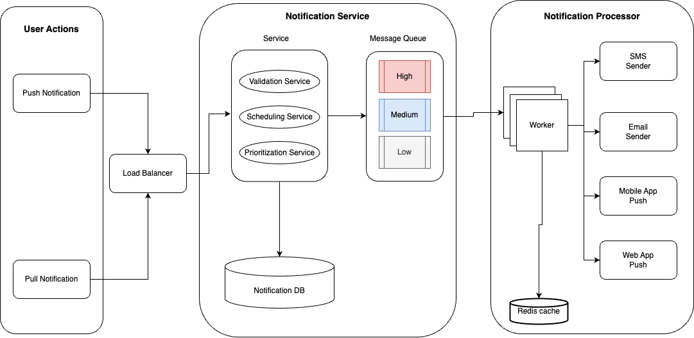

# Notification system #

The notification system consists of three main components:

- **User Actions**: User actions trigger the generation of events that drive the notification system. These actions may include posting a new message, commenting on a post, being tagged in a photo, or receiving a friend request.
- **Notification Service**: The notification service is a central repository where all events that trigger notifications are stored. These events are processed in real-time to ensure users receive timely notifications.
- **Notification Processor**: The notification processor consumes events from the message queue and processes them to determine what notifications need to be sent. This may involve checking user preferences, filtering out duplicate notifications, and generating notification content.

## User Actions ##

The notification system utilizes a combination of push and pull notification styles:

- **Push Notifications**: For time-sensitive notifications, such as new messages or friend requests, the notification system pushes notifications directly to the user's device or browser. This ensures that users receive notifications immediately, even if they are not actively using the social network website or app.
- **Pull Notifications**: For less time-sensitive notifications, such as notifications about activity in groups or updates from followed users, the notification system utilizes a pull notification style. Users can periodically check their notification feed to see a summary of these notifications.

## Notification Service ##

This exposes REST APIs to clients and interacts with the clients. 

We can define Notification service into three components:

- **Validation Service**: This service is solely responsible for validating notification messages against business rules and expected format
- **Scheduling Service**: This service will provide APIs to schedule notifications immediately or at any given time. It could be any of the followings: Second, Minute, Hourly, Daily...
- **Prioritization Service**: It will also prioritize notification based on high, medium, and low priorities. OTP notification messages have a higher priority with a time-bound expiry time, they will always be sent in higher priority.

### 👉 Notification Database ###

Store all notification messages with their delivery time and status. Metadata contains the destination and sources.

To ensure scalability and availability, the notification database should use are Casandra or mongoDB. The reasons are:
- **Schema Flexibility**: Social networking apps like Facebook constantly evolve with new features and entities, so their database schemas should be flexible enough to accommodate new notifications related to these additions.
- **Write-heavy System**: Social networking apps like Facebook generate a vast amount of data, including posts, friend requests, and group activities, which continuously trigger notifications.
- **Highly available System**:  Our system should be highly available to capture every event.

### 👉 Message Queue ###

- The notification system's workload includes data management, information processing, and third-party notifications. Processing and sending notifications can be resource-intensive, leading to system overload if handled in a single service. Decoupling these services is crucial for efficient operation.

- Message queues are essential for notification systems due to their ability to decouple processing and delivery, ensuring asynchronous operation, load leveling, fault tolerance, scalability, flexibility, message ordering, retrying, dead-letter queuing, monitoring, alerting, and integration with third-party systems.

- The message queue is implemented using a distributed message queue system, such as Kafka, Redis or RabbitMQ. This ensures that events can be handled efficiently even at high volumes.

## Notification Processor ##

The notification processor is a critical component of the notification system, responsible for processing events and determining which notifications to send users. It performs several key tasks, including:

- Consuming and validating events
- Checking user preferences and filtering duplicates
- Generating and prioritizing notifications
- Routing notifications to the appropriate channel
- Tracking delivery status and optimizing performance
- Handling errors and interruptions gracefully

The notification processor is designed to be robust, scalable, and efficient, ensuring that users receive timely, relevant, and personalized notifications.

### 👉 Notification Vendors ###
- IOS notification delivery is handled by APNs. You trigger their API with the required payload and they deliver the notification to the user.
- Similarly, GCM (Google Cloud Messaging) by Google sends the notification to android devices.
- AWS SNS or Mailchimp for sending email notifications.
- Twilio for SMS.

# Infrastructure (Scalability and Availability) #

To ensure scalability and availability, the notification system is designed using a distributed architecture with microservices. Each component of the system is deployed as a separate microservice, allowing for independent scaling and fault tolerance.

- Event Queue: The event queue is implemented using a distributed message queue system, such as Kafka, Redis or RabbitMQ. This ensures that events can be handled efficiently even at high volumes.
- Notification Processor:  The notification processor is deployed as a distributed service, allowing it to scale horizontally to handle large volumes of events.